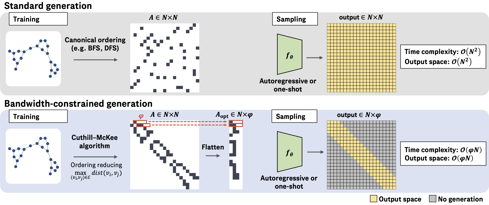

# Bandwidth Restricted Graph Generation
Repo for [Improving Graph Generation by Restricting Graph Bandwidth](https://arxiv.org/abs/2301.10857).
Implemented in python 3.10.


## setup
Here's how to build the conda environment:
```
conda env create --file env.yml
conda activate graph_gen
pip install -e .
```
Here's how to build [orca](https://github.com/thocevar/orca) to do orbit calculations for MMD evaluations:
```
cd graph_gen/analysis
g++ -std=c++11 -o orca.exe orca.cpp
```
Here's how to prepare the molecular datasets:
```
cd datasets
unzip zinc.tab.zip
unzip peptide_multi_class_dataset.csv.zip
```

## layout
- `graph_gen/data` has synthetic and molecular datasets
- `graph_gen/models` contains models and model training + hyperoptimization scripts
- `graph_gen/analysis` has MMD calculations

## hyperparameters
The hyperparameters we found using hyperoptimization are in `hyperparameters`.

## hyperoptimizing models
Hyperoptimization scripts are in `graph_gen/models/hyperoptimize`.
The scripts have help for all of their arguments.
GraphRNN example:
```
conda activate graph_gen
python graph_gen/graph_gen/hyperoptimize_graphRNN.py --epochs 10 \ 
    --order C-M --data_name PROTEINS --version TEST --count 3
```
VAE example:
```
conda activate graph_gen
python graph_gen/graph_gen/hyperoptimize_gine_vae.py --order C-M --data_name PROTEINS \
    --edge_augmentation none --hidden_dim 32 --epochs 10 --version TEST --count 2 \ 
    --empirical_bw
```
Diffusion example:
```
conda activate graph_gen
python graph_gen/graph_gen/hyperoptimize_gine_diffusion.py --order BFS --data_name zinc250k \ 
    --hidden_dim 128 --version TEST-v4 --count 2 --epochs 5
```

## train-evaluate
Train-evaluate scripts which use the hyperparameters found in hyperopt are in `graph_gen/models/train_evaluate/`.
The scripts have help for all of their arguments.
GraphRNN example:
```
conda activate graph_gen
python graph_gen/graph_gen/train_evaluate_graphRNN.py \ 
    --lr 0.0011 --wd 0.007 --order BFS --data_name ENZYMES --temperature 0.4 \ 
    --epochs 10 --version GraphRNNevalTEST --replicate 0
```
VAE example: 
```
conda activate graph_gen

python graph_gen/graph_gen/train_evaluate_gine_vae.py \ 
    --kl_weight 0.0003 --lr 0.005 --order BFS --data_name ENZYMES --version \ 
    gine_vae_eval_TEST --sigma 1 --epochs 10 --replicate 0 --hidden_dim 32
```
Diffusion example:
```
conda activate graph_gen
python graph_gen/graph_gen/train_evaluate_gine_diffusion.py --data_name DD \
    --order C-M --lr 0.004 --hidden_dim 64 --empirical_bw --version diffusion_eval_TEST \ 
     --epochs 5 --replicate 0
```
